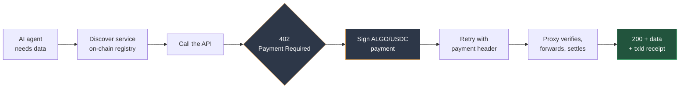
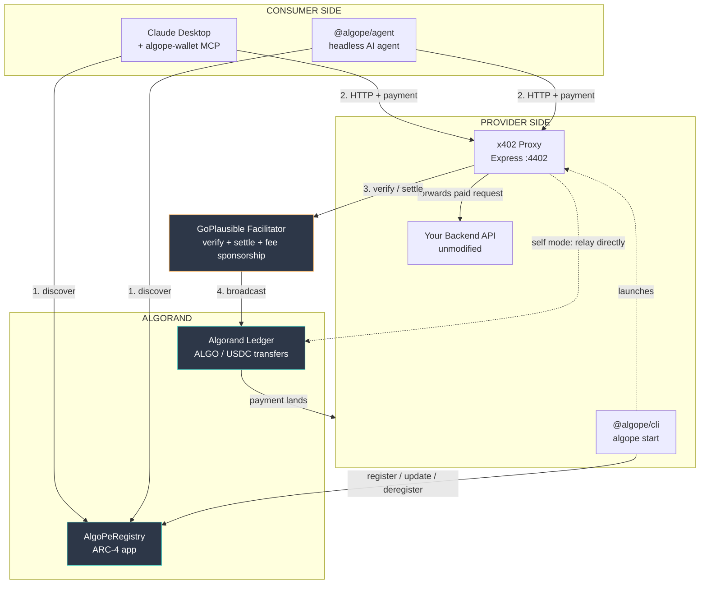
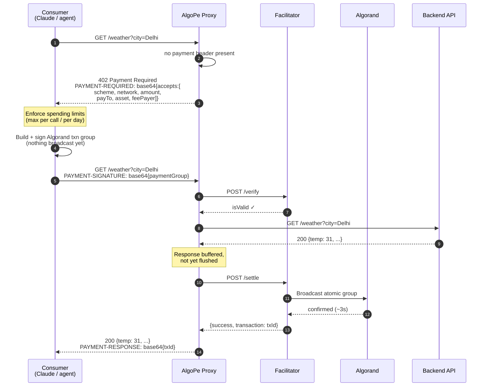
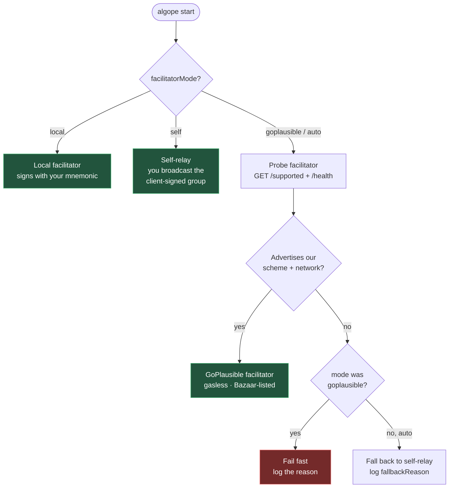
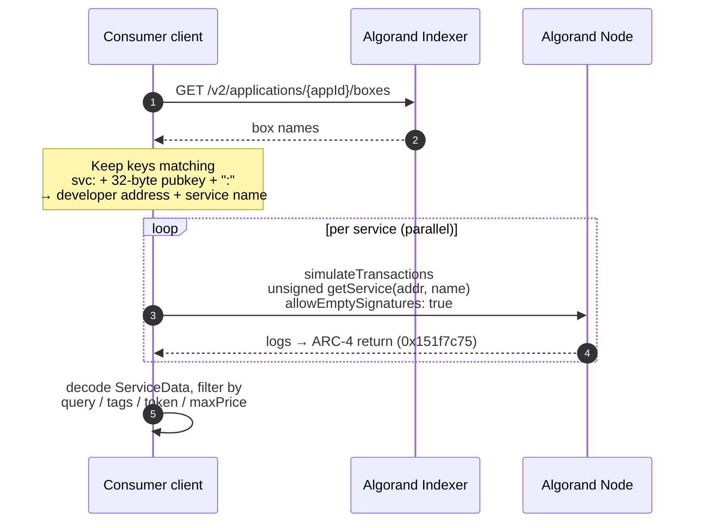
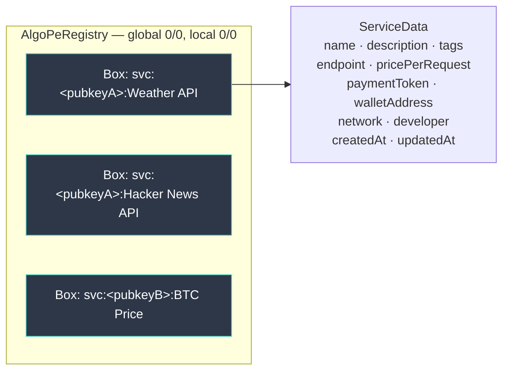
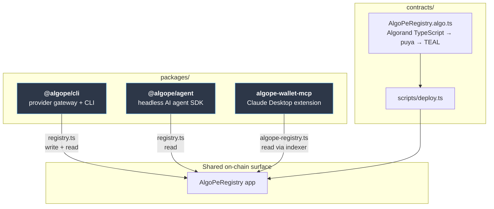

# AlgoPe


**Monetize any HTTP API with blockchain micropayments. Consume paid APIs directly from Claude and other AI tools — no accounts, no API keys.**

AlgoPe is a decentralized API marketplace built on Algorand. API developers publish their services to an on-chain registry and gate every request with the [x402 protocol](https://www.x402.org/) — trustless, pay-per-request micropayments in ALGO or USDC. Consumers discover and call those services by installing the AlgoPe MCP extension into Claude Desktop or any MCP-compatible AI tool.

---

## How It Works



No accounts. No API keys. No subscriptions. The payment *is* the authentication, and it settles on Algorand in about three seconds.

---

## For API Developers — Publish & Monetize

Register any existing HTTP API in two commands. No changes to your backend required.

### Install

```bash
npm install -g @algope/cli
```

### 1. Configure your service

```bash
algope init
```

The interactive prompt collects:

```
Service name        › Weather API
Description         › Real-time weather and forecast data
Tags                › weather, forecast, data
Backend URL         › http://localhost:3001
Price per request   › 0.01
Payment token       › ALGO
Your wallet address › EZDWPOTBKBWCBQ4M6QXWF4Z3PJB5Q6XN6XAGL5KPR3ESC3HF33J...
Proxy port          › 4402
Network             › testnet
```

Your wallet address is all you need — the proxy verifies payments and forwards them directly to your wallet on-chain. It never holds your funds or needs your private key.

### 2. Start the payment gateway

```bash
algope start
```

This launches an x402 reverse proxy in front of your backend. Every incoming request must carry a valid Algorand payment or it gets a `402 Payment Required` response.

```
AlgoPe proxy started
  Service   Weather API
  Target    http://localhost:3001
  Price     0.01 ALGO per request
  Wallet    EZDWPOTB...57A4
  Network   testnet
  Listening http://localhost:4402
```

### 3. Register on-chain

```bash
algope register
```

This publishes your service to the `AlgoPeRegistry` smart contract on Algorand (costs 1 ALGO). Once registered, any consumer with the AlgoPe MCP extension can discover and call your API immediately.

### CLI Reference

| Command | What it does |
|---|---|
| `algope init` | Interactive setup — creates `~/.algope/config.json` |
| `algope start` | Start the x402 payment proxy |
| `algope register` | Publish service to the Algorand registry |
| `algope list` | Show your registered service as stored on-chain |
| `algope status` | Show config, wallet balance, and registration status |

### Payment settlement — the GoPlausible facilitator

A *facilitator* is the service that verifies an x402 payment and broadcasts it on-chain. AlgoPe defaults to [GoPlausible's hosted Algorand x402 facilitator](https://facilitator.goplausible.xyz), the reference facilitator for x402 on Algorand.

Using it buys three things:

- **Gasless for your callers.** The facilitator advertises a `feePayer` in its `/supported` response, which AlgoPe copies into every `402` challenge. Paying clients build an atomic group where the facilitator covers the Algorand fee — the consumer needs only USDC, no ALGO.
- **No key on your box.** Verification and settlement happen off-box, so `algope start` never needs a mnemonic to broadcast.
- **Bazaar discovery.** Resources settled through the facilitator appear in its `/discovery/resources` catalog, which is what Bazaar-aware clients read.

`algope start` preflights the facilitator's `/supported` and `/health` before serving. If it can't settle your token on your network, AlgoPe logs why and falls back to settling locally rather than refusing to boot.

| Mode | Who settles | Needs a key? | Payer covers fee? |
|---|---|---|---|
| `auto` *(default)* | GoPlausible, local fallback | No | No, when remote |
| `goplausible` | GoPlausible only — fails fast if unusable | No | No |
| `self` | You relay the client-signed group | No | Yes |
| `local` | In-process facilitator, signs with your mnemonic | Yes | No |

```bash
algope start                                    # auto
algope start --facilitator-mode goplausible     # require the hosted facilitator
algope start --facilitator-mode self            # settle it yourself
algope start --facilitator-url https://my-fac   # self-hosted facilitator
algope start --facilitator-key "$TOKEN"         # or ALGOPE_FACILITATOR_API_KEY
```

> **ALGO-priced services cannot use the remote facilitator.** Native-ALGO pricing settles under AlgoPe's own `algo-exact` scheme, which is not part of upstream x402-avm — the hosted facilitator only advertises `exact` (ASA/USDC) for Algorand. Price in **USDC** to get gasless settlement and Bazaar discovery; ALGO-priced services fall back to local settlement automatically, and the consumer pays their own network fee.

### Config file (`~/.algope/config.json`)

| Field | Description |
|---|---|
| `serviceName` | Display name for your service |
| `serviceDescription` | Short description shown to consumers |
| `tags` | Comma-separated keywords for discovery |
| `targetUrl` | Your backend API URL |
| `pricePerRequest` | Price in ALGO or USDC |
| `paymentToken` | `"ALGO"` or `"USDC"` |
| `walletAddress` | Your Algorand wallet address (receives payments) |
| `proxyPort` | Port the x402 proxy listens on |
| `network` | `"testnet"` or `"mainnet"` |
| `facilitatorMode` | `"auto"` \| `"goplausible"` \| `"local"` \| `"self"` — see below |
| `facilitatorUrl` | Override the facilitator base URL (self-hosted) |
| `facilitatorApiKey` | Bearer token, for facilitators that gate `/verify` and `/settle` |

---

## For Consumers — Use Paid APIs from LLMs

Install the AlgoPe MCP extension into Claude Desktop, OpenAI, Antigravity, or whatever you want. The LLM gets an Algorand wallet, discovers services registered on-chain, and pays for them automatically within your configured budget.

### Install in Claude Desktop

1. Download `algope.mcpb` from [Releases](https://github.com/SamyaDeb/AlgoPe/releases)
2. Double-click the `.mcpb` file — Claude Desktop installs it automatically
3. Open Claude Desktop → Settings → Extensions → AlgoPe
4. Fill in your Algorand wallet mnemonic (25 words) and set spending limits

| Config field | Default | Description |
|---|---|---|
| Algorand Mnemonic | — | 25-word seed phrase, stored in OS Keychain |
| Network | `algorand-testnet` | `algorand` or `algorand-testnet` |
| Max per payment | `0.10 USDC` | Hard cap per single API call |
| Max per day | `20.00 USDC` | Daily spending limit |
| Registry App ID | `769455464` | Leave as-is unless running a custom registry |

### What Claude can do once installed

| Tool | Description |
|---|---|
| `search_bazaar` | Discover services registered on the AlgoPe Algorand registry |
| `x402_fetch` | Call a service URL — auto-handles 402, signs payment, retries |
| `check_balance` | View wallet balance and address |
| `pay` | Sign an x402 payment authorization |
| `transfer_usdc` | Send USDC to any Algorand address |
| `transfer_algo` | Send ALGO (for gas) |
| `spending_report` | Review today's spend against limits |
| `request_funding` | Generate a Pera Wallet top-up link |
| `tinyman_swap` | Swap tokens via TinyMan DEX |
| `create_token` | Create a new Algorand Standard Asset |

### Example

Ask Claude:

> *"Find me trending tech news and summarize the top stories."*

Claude will:
1. Call `search_bazaar` → find the Hacker News API registered on Algorand
2. Call `x402_fetch` → get a `402`, sign a USDC payment, retry
3. Receive the data and summarize it in the chat

No API keys. No subscriptions. The payment settles on Algorand in under 5 seconds.

---

---

## For Consumers — Headless Agents (`@algope/agent`)

If you want an agent that runs without Claude Desktop — in a script, a cron job, or your own backend — use the agent SDK. It wraps the Vercel AI SDK and adds discovery plus x402 payment as tools the model can call.

```bash
npm install -g @algope/agent
algope-agent init        # wizard — mnemonic goes into your OS keychain
algope-agent services    # list what's registered on-chain
algope-agent run "get the weather in Delhi and summarize it"
```

```ts
import { AlgoPeAgent } from "@algope/agent";

const agent = await AlgoPeAgent.fromConfig();

const result = await agent.run("Find the BTC price and tell me if it moved today", {
  maxSteps: 5,
  onPayment: (r) => console.log(`paid ${r.amount} ${r.token} for ${r.service} → ${r.txId}`),
});

console.log(result.text);
console.log(`${result.payments.transactionCount} payments`, result.payments.totalSpent);
```

| Command | What it does |
|---|---|
| `algope-agent init` | Wizard — stores the mnemonic in the OS keychain |
| `algope-agent status` | Wallet address, balances, configured model |
| `algope-agent services` | List services from the on-chain registry |
| `algope-agent run <task>` | Run a task; pays for services as needed |
| `algope-agent migrate-keychain` | Move a legacy plaintext mnemonic into the keychain |

Config lives at `~/.algope/agent.json` (mode `0600`), and **never contains the mnemonic** — that goes to the macOS Keychain, libsecret, or Windows Credential Manager via `keytar`. Supported model providers: OpenAI, Anthropic, Google, Groq, Ollama, and any OpenAI-compatible endpoint.

> **Key storage differs by package, deliberately.** `@algope/agent` uses the OS keychain. The Claude Desktop extension receives its mnemonic from Desktop's own encrypted storage via an env var, falling back to `~/.algope/wallet.json` (mode `0600`) if you run it standalone.
---

## On-Chain Deployment

### Registry Contract (Algorand Testnet)

| | |
|---|---|
| **App ID** | `769455464` |
| **Standard** | ARC-4 (ABI-compatible), ARC-56 app spec |
| **Source** | `contracts/src/AlgoPeRegistry.algo.ts` (Algorand TypeScript) |
| **Compiler** | puya `5.9.0` via `algokit compile ts` |
| **Global / local state** | none — 0 uints, 0 byte slices |
| **Storage** | one box per service, key `svc:<developer_pubkey>:<service_name>` |
| **Registration fee** | 1 ALGO → admin wallet (hardcoded in the contract) |
| **Box storage cost** | ~0.42 ALGO MBR, paid by the registering developer, refunded on `deregister` |

The contract has no `updateApplication` or `deleteApplication` handler, so **once deployed it is immutable and cannot be deleted.** Changing the admin address, the fee, or any logic requires deploying a fresh app.

### Deploying your own registry

```bash
cd contracts
npm install
npm run compile                    # algokit compile ts src/  → src/out/

DEPLOYER_MNEMONIC="word1 ... word25" FORCE_NEW=true npm run deploy:testnet
```

| Variable | Purpose |
|---|---|
| `DEPLOYER_MNEMONIC` | 25-word mnemonic of the deploying account (needs ≥ 2 ALGO) |
| `NETWORK` | `testnet` (default) or `mainnet` |
| `FORCE_NEW` | `true` creates a fresh app. **Required for redeploys** — the default idempotent path uses `onUpdate: "update"`, which cannot succeed against this non-updatable contract |

The script prints the new App ID. Point the clients at it with `ALGOPE_REGISTRY_APP_ID`, which every package checks before falling back to its compiled-in default:

```bash
export ALGOPE_REGISTRY_APP_ID=769455464
```

Prerequisites: [AlgoKit CLI](https://github.com/algorandfoundation/algokit-cli) (`brew install algokit`) for compilation, and Node 18+.

> Deploying a new registry starts it **empty** — existing registrations live in the old app's boxes and do not carry over. Providers must re-register against the new App ID.
---

## Architecture

AlgoPe has three moving parts: a **provider-side gateway** that puts a paywall in front of any HTTP API, an **on-chain registry** that makes those APIs discoverable, and **consumer-side clients** that find services and pay for them autonomously. Nothing custodial sits in the middle — payments go wallet-to-wallet on Algorand.

### System context



### The x402 request/payment cycle

This is the core loop. The consumer never registers an account or holds an API key — the payment *is* the authentication.



**Why the payment settles *after* the backend responds:** the proxy verifies the signature first (cheap, off-chain), then forwards to your backend while **buffering** the response. Only once the backend returns a success status does it settle on-chain and flush the body. If your backend returns `4xx`/`5xx`, the buffered error is replayed and **no settlement happens — the caller is not charged.** Conversely, the caller cannot read the body without a valid signed authorization.

Discovery, by contrast, is completely free: reading the registry uses `simulateTransactions` with `allowEmptySignatures`, so listing and inspecting services costs no ALGO and creates no transaction.

### Facilitator selection

`algope start` preflights the facilitator before serving a single request, and degrades instead of refusing to boot. This is the decision tree in `packages/algope/src/facilitator/resolve.ts`.



> **Token choice drives this.** USDC prices settle under the standard `exact` scheme the hosted facilitator supports — so callers pay no ALGO fee and the service appears in Bazaar discovery. Native-ALGO prices use AlgoPe's own `algo-exact` scheme, which upstream x402-avm does not implement, so they always fall back to self-relay and the caller covers their own network fee.

### On-chain registration

Registering is a two-step, three-transaction operation. The registering developer funds the contract's box storage themselves, so the app account never needs a treasury.

```mermaid
sequenceDiagram
    autonumber
    participant D as Developer<br/>(algope register)
    participant A as Algorand
    participant R as AlgoPeRegistry app
    participant W as Admin wallet

    Note over D: Preflight: balance >= <br/>1 ALGO fee + box MBR + tx fees

    D->>A: Txn 1 — Payment to app address<br/>(box MBR: 2500 + 400 x bytes)
    A-->>D: confirmed

    rect rgb(45, 55, 72)
    Note over D,R: Atomic group (both succeed or both fail)
    D->>A: Txn 2 — Payment 1 ALGO to admin
    D->>A: Txn 3 — AppCall register(pay, name, ...)
    end

    A->>R: execute register()
    R->>R: verifyPayment(): sender, receiver,<br/>amount >= 1 ALGO
    R->>R: assert box does not already exist
    R->>R: write ServiceData to box<br/>"svc:" + pubkey + ":" + name
    A->>W: 1 ALGO lands
    A-->>D: confirmed — service is discoverable
```



`deregister(name)` reverses it: the contract deletes the box and returns the released minimum-balance requirement to the developer via an inner payment. `update(...)` charges the fee again but preserves `developer` and `createdAt`.

### Discovery — free, read-only

Both consumer clients (`search_bazaar` in the MCP extension, `discoverService` in the agent) enumerate the registry the same way, without spending anything:



### Registry data model

The contract keeps **no global or local state at all** — every registration lives in its own box, so the registry scales to any number of services without schema limits.



Because the box key embeds the developer's public key, two developers can register the same service name without collision, and only the original developer's address can update or delete their own entry.

### Package map



All three clients resolve the registry App ID the same way: `ALGOPE_REGISTRY_APP_ID` environment variable → local config file → compiled-in default.

### Repository layout

```
algope/
├── contracts/
│   ├── src/
│   │   ├── AlgoPeRegistry.algo.ts     # ARC-4 on-chain service registry
│   │   └── out/                        # compiled TEAL + ARC-32/56 artifacts
│   └── scripts/deploy.ts               # deployment script
│
├── packages/
│   ├── algope/                        # @algope/cli — provider SDK & CLI
│   │   ├── src/
│   │   │   ├── cli.ts                  # init / start / register / list / status
│   │   │   ├── proxy/
│   │   │   │   ├── server.ts           # x402 reverse proxy (Express)
│   │   │   │   ├── routeConfig.ts      # per-route pricing
│   │   │   │   └── analytics.ts        # payment logs and stats
│   │   │   ├── registry.ts             # on-chain registry client
│   │   │   ├── facilitator/
│   │   │   │   ├── resolve.ts          # picks the facilitator + fallback logic
│   │   │   │   ├── goplausible.ts      # hosted facilitator client
│   │   │   │   ├── local-facilitator-client.ts
│   │   │   │   ├── algo-facilitator.ts # native-ALGO self-settlement
│   │   │   │   └── simple-verifier.ts  # ASA self-settlement
│   │   │   ├── wallet-connect.ts       # Pera WalletConnect registration
│   │   │   └── x402/algo/server-scheme.ts
│   │   └── register-public.mjs         # non-interactive re-registration
│   │
│   ├── algope-agent/                  # @algope/agent — headless AI agent
│   │   └── src/
│   │       ├── agent.ts                # Vercel AI SDK loop
│   │       ├── payment.ts              # x402 payment handling
│   │       ├── wallet.ts / keychain.ts # key storage
│   │       ├── registry.ts             # service discovery
│   │       └── cli.ts                  # init / status / services / run
│   │
│   └── algope-wallet/                 # algope-wallet-mcp — Claude extension
│       ├── src/
│       │   ├── server.ts               # MCP server (stdio JSON-RPC)
│       │   ├── algope-registry.ts     # registry reader
│       │   ├── spending.ts             # budget enforcement
│       │   └── tools/                  # x402-fetch, bazaar-search, pay, ...
│       ├── manifest.json               # MCP extension manifest
│       └── algope.mcpb                # installable Claude Desktop bundle
│
├── examples/
│   ├── weather-api.mjs                 # example backend: weather (:3001)
│   ├── btc-api.mjs                     # example backend: crypto prices (:3002)
│   ├── algope-weather-api.mjs         # zero-dependency backend
│   ├── weather-railway/                # Railway-deployable backend
│   └── proxy-railway/                  # Railway-deployable standalone proxy
│
├── frontend/                           # landing page + docs site
└── docs/                               # architecture, contributing, security, changelog
```

> **Architecture deep-dive:** [`docs/ARCHITECTURE.md`](docs/ARCHITECTURE.md) covers the payment
> handshake, registry box-storage design, the two x402 schemes, and how a facilitator is chosen
> at startup.

### Trust model

| Party | Holds your keys? | Can withhold payment? | Can fake a payment? |
|---|---|---|---|
| AlgoPe proxy | No — provider supplies only a wallet **address** | No — funds go wallet-to-wallet | No |
| Facilitator | No — it broadcasts an already-signed group | It can refuse to settle; AlgoPe falls back | No |
| Registry contract | No | No — it never touches payment funds | No |
| Consumer wallet | Your mnemonic, in OS Keychain | — | No — signatures verify on-chain |

The registry charges a 1 ALGO listing fee to a hardcoded admin address; it takes no cut of any API payment.

---
## Smart Contract Methods

The `AlgoPeRegistry` ARC-4 contract exposes eight methods. The four query methods are marked `readonly`, so clients call them through `simulateTransactions` at zero cost.

| Method | ABI signature | Auth | Fee |
|---|---|---|---|
| `createApplication` | `createApplication()void` | on-create only | — |
| `register` | `register(pay,string,string,string,string,string,string,string,string)void` | any sender; box must not exist | 1 ALGO + box MBR |
| `update` | `update(pay,string,string,string,string,string,string,string,string)void` | original developer only | 1 ALGO |
| `deregister` | `deregister(string)void` | original developer only | free; refunds MBR |
| `getService` | `getService(address,string)(string,string,string,string,string,string,string,string,address,uint64,uint64)` | readonly | free |
| `hasService` | `hasService(address,string)bool` | readonly | free |
| `getAdmin` | `getAdmin()string` | readonly | free |
| `getRegistrationFee` | `getRegistrationFee()uint64` | readonly | free |

The leading `pay` argument on `register` and `update` is the grouped 1 ALGO payment to the admin wallet; the contract asserts its sender, receiver, and amount before touching storage. `update` and `deregister` compare the caller against the `developer` field stored in the box, so no one can edit or remove another developer's listing.

The `ServiceData` value written to each box:

| Field | Type | Notes |
|---|---|---|
| `name` | `string` | also part of the box key |
| `description` | `string` | shown in discovery results |
| `tags` | `string` | comma-separated, used for filtering |
| `endpoint` | `string` | **the x402 proxy URL**, not your backend |
| `pricePerRequest` | `string` | decimal, e.g. `"0.01"` |
| `paymentToken` | `string` | `ALGO` or `USDC` |
| `walletAddress` | `string` | where payments land |
| `network` | `string` | `testnet` or `mainnet` |
| `developer` | `address` | set from `Txn.sender`, immutable |
| `createdAt` / `updatedAt` | `uint64` | block timestamps |

> Register the **proxy** endpoint, not your backend. Consumers call the URL in the registry, and only the proxy can issue the 402 challenge that makes payment happen.

---

## Tech Stack

| Layer | Technology |
|---|---|
| Language | TypeScript (ESM), Node.js 22 |
| Web framework | Express.js |
| Blockchain | Algorand Testnet / Mainnet |
| Smart contracts | Algorand TypeScript → puya → TEAL (ARC-4) |
| Payment protocol | x402-AVM |
| Payment SDK | `@x402-avm/express`, `@x402-avm/core` |
| Algorand SDK | `algosdk` v3 |
| MCP protocol | `@modelcontextprotocol/sdk` v1 |
| CLI tooling | Commander, `@clack/prompts`, Chalk |
| Security | OS Keychain for mnemonic storage |
| Build | tsup, npm workspaces |

---

## Algorand MCP (development)

This repo ships a `.mcp.json` wiring in GoPlausible's [Algorand MCP server](https://github.com/GoPlausible/algorand-mcp), so an AI assistant working in this repo can query Algorand directly — no extra setup beyond trusting the server when your client prompts.

```json
{
  "mcpServers": {
    "algorand": {
      "type": "stdio",
      "command": "npx",
      "args": ["-y", "@goplausible/algorand-mcp"]
    }
  }
}
```

It's the same facilitator vendor as the payment path above, which makes it a useful companion for working on AlgoPe:

| Use it to | Tools |
|---|---|
| Inspect the deployed `AlgoPeRegistry` (app `769455464`) — box contents, global state, call history | Algod API, Indexer API |
| Check a provider wallet's balance and USDC opt-in before a test payment | Algod API, account tools |
| Debug the registry contract's TEAL — compile, disassemble, simulate a call | Algod tools |
| Cross-check AlgoPe's `search_bazaar` against the facilitator's own Bazaar catalog | x402 tools |
| Resolve NFDomain names, quote Tinyman swaps | NFDomains, Tinyman |

Add it to Claude Code globally instead with:

```bash
claude mcp add algorand -- npx -y @goplausible/algorand-mcp
```

> The MCP server keeps its own agent wallet in a SQLite DB at `~/.algorand-mcp/wallet.db`, separate from AlgoPe's config. Its x402 tools overlap with the AlgoPe wallet extension — for *using* paid APIs from Claude, prefer the AlgoPe MCP extension, which additionally enforces your spending limits.

---

## Local Development

```bash
git clone https://github.com/SamyaDeb/AlgoPe.git
cd AlgoPe
npm install          # workspaces: packages/* only
npm run build
```

**End-to-end on testnet**, three terminals:

```bash
# 1 — a backend to sell
node examples/weather-api.mjs          # :3001

# 2 — the paywall in front of it
algope init                           # configure service + wallet
algope start                          # x402 gateway on :4402
algope register                       # publish to the registry (~1.5 ALGO)

# 3 — a consumer
algope-agent init
algope-agent run "what's the weather in Delhi?"
```

Example backends: `weather-api.mjs` (`:3001`), `btc-api.mjs` (`:3002`, live CoinGecko with mock fallback), `algope-weather-api.mjs` (zero-dependency). `examples/weather-railway/` and `examples/proxy-railway/` are deployable variants for putting a backend and a standalone proxy on Railway.

**Workspace scripts**

| Command | What it does |
|---|---|
| `npm run build` | Build all three packages |
| `npm run typecheck` | Typecheck every workspace |
| `npm run test:wallet` | Vitest suite for the MCP wallet |
| `npm run build:mcpb` | Produce `algope.mcpb` for Claude Desktop |

**Contracts** are deliberately outside the npm workspaces and need their own install:

```bash
cd contracts && npm install
npm run compile      # requires the AlgoKit CLI
```

> Testnet funds: [ALGO faucet](https://bank.testnet.algorand.network/) · [USDC dispenser](https://dispenser.testnet.aws.algodev.network/) — USDC on testnet is ASA `10458941`, and your wallet must opt in before it can be paid in USDC.

---

## License

MIT
