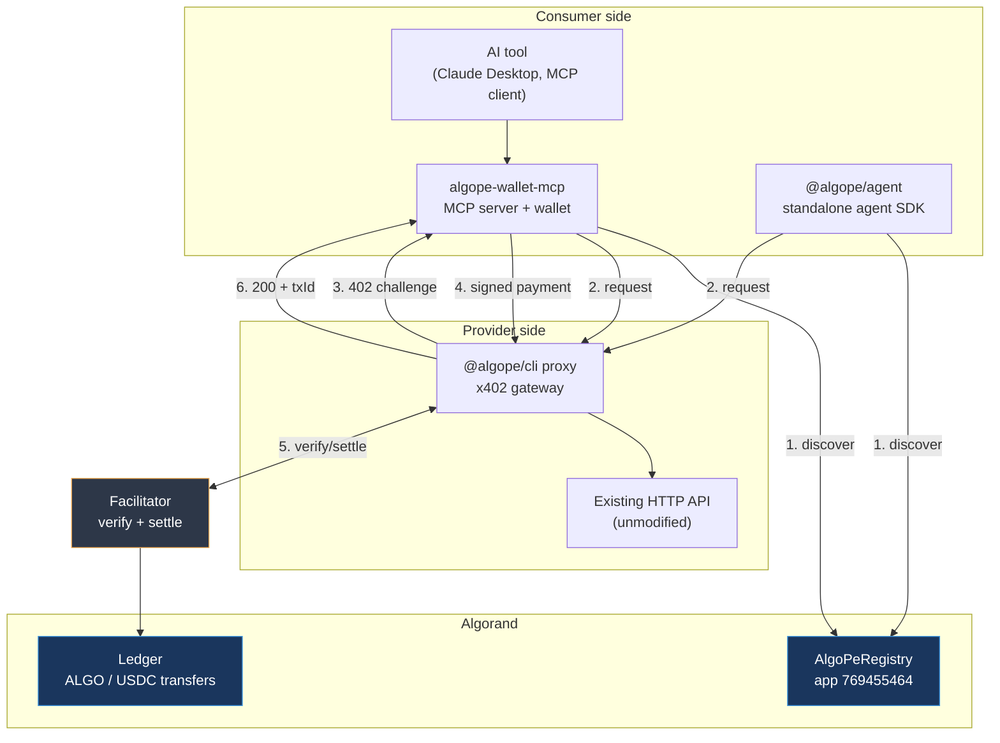
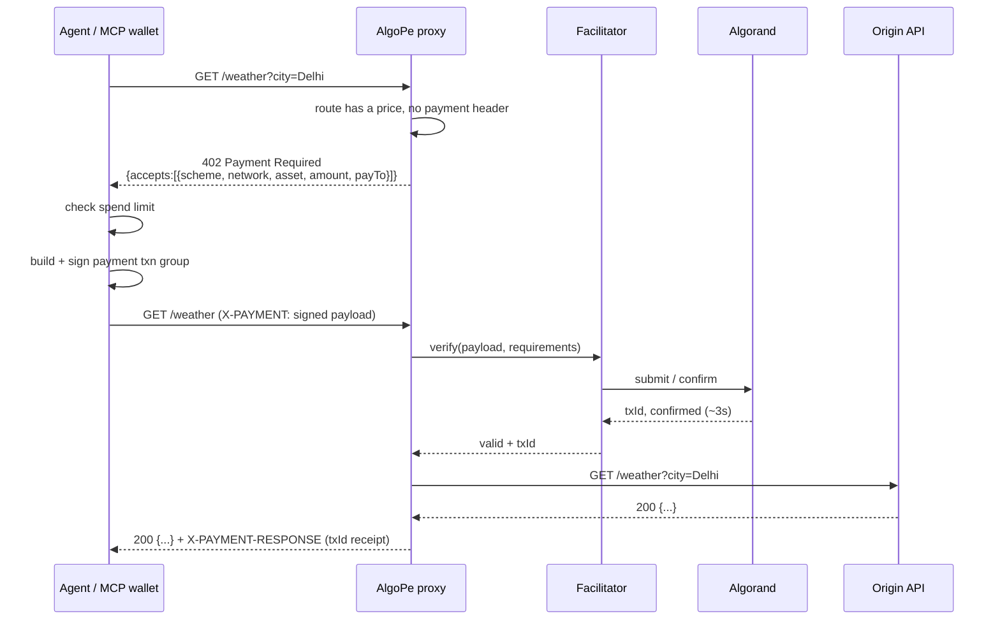
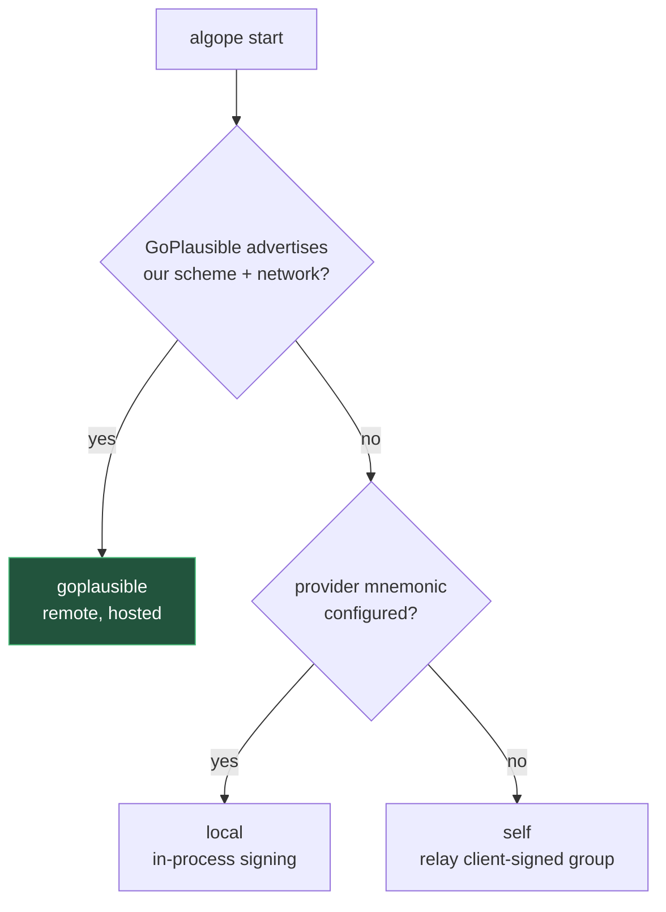

# AlgoPe Architecture

How AlgoPe turns an ordinary HTTP API into a pay-per-request service, and how an AI agent
discovers and pays for it without ever holding an account on the provider's side.

- [System overview](#system-overview)
- [Components](#components)
- [The payment handshake](#the-payment-handshake)
- [On-chain registry](#on-chain-registry)
- [Payment schemes](#payment-schemes)
- [Facilitator selection](#facilitator-selection)
- [Trust model](#trust-model)
- [Repository layout](#repository-layout)
- [Configuration](#configuration)

---

## System overview

AlgoPe has two sides that never talk to each other directly — they meet at an HTTP
request and settle on Algorand.



The provider's API is never modified. The proxy sits in front of it and refuses to forward
a request until payment for that request has been verified.

---

## Components

| Component | Package | Role |
|---|---|---|
| **Registry contract** | `contracts/` | ARC-4 smart contract holding the service catalog in box storage |
| **Provider CLI + proxy** | `@algope/cli` | Registers services on-chain; runs the x402 reverse proxy that gates the API |
| **Consumer agent SDK** | `@algope/agent` | Standalone agent that discovers services and pays for them programmatically |
| **Wallet MCP server** | `algope-wallet-mcp` | Gives Claude Desktop (or any MCP client) an Algorand wallet and x402 fetch |
| **Frontend** | `frontend/` | Static landing page and API documentation |
| **Examples** | `examples/` | Reference APIs (weather, BTC price, Hacker News) and Railway deploy configs |

### Provider proxy — `@algope/cli`

`algope start` boots an Express server that wraps the origin API:

```
src/proxy/server.ts        Express app, x402 middleware, proxy to origin
src/proxy/routeConfig.ts   Per-route pricing rules
src/proxy/analytics.ts     Request/payment counters, admin endpoints
src/registry.ts            On-chain service CRUD
src/x402/algo/server-scheme.ts   Native-ALGO scheme (algo-exact)
src/facilitator/           Verification and settlement strategies
```

Pricing is per route, so one deployment can charge different amounts for different
endpoints, or leave some endpoints free.

### Consumer wallet — `algope-wallet-mcp`

An MCP server exposing ten tools to the AI client:

`check_balance` · `pay` · `x402_fetch` · `transfer_algo` · `transfer_usdc` ·
`tinyman_swap` · `bazaar_search` · `request_funding` · `spending_report` · `create_token`

`x402_fetch` is the important one — it performs the full 402 handshake transparently, so
the model just asks for a URL and gets data back. `spending.ts` enforces a spend ceiling
before any transaction is signed, which is what keeps an autonomous agent from draining a
wallet.

---

## The payment handshake

This is the x402 flow, which is HTTP 402 "Payment Required" — a status code reserved in
HTTP/1.1 since 1997 and left unused until now.



Two properties fall out of this design:

- **The payment is the authentication.** There is no API key, no account, no signup. A
  valid settled payment for this request is the only credential.
- **Settlement is per request.** No prepaid balance sits with the provider, and no
  subscription needs cancelling.

---

## On-chain registry

`AlgoPeRegistry` (`contracts/src/AlgoPeRegistry.algo.ts`) is an ARC-4 contract deployed on
Algorand testnet as **app 769455464**.

### Storage

Services live in an ARC-54 `BoxMap` under the `svc:` prefix, keyed by a composite of
developer address and service name:

```
key   = "svc:" + <developer_address_bytes> + ":" + <service_name_bytes>
value = ServiceData
```

Keying by developer address means two providers can register the same service name without
colliding, and a provider can only ever mutate their own boxes.

### `ServiceData`

| Field | Type | Meaning |
|---|---|---|
| `name` | `Str` | Service identifier, unique per developer |
| `description` | `Str` | Human/agent-readable summary used for discovery |
| `tags` | `Str` | Comma-separated search tags |
| `endpoint` | `Str` | Public proxy URL |
| `pricePerRequest` | `Str` | Price in base units |
| `paymentToken` | `Str` | `ALGO` or `USDC` |
| `walletAddress` | `Str` | Where payments land |
| `network` | `Str` | `testnet` or `mainnet` |
| `developer` | `Address` | Owner; enforced on update and deregister |
| `createdAt` / `updatedAt` | `Uint64` | Block timestamps |

### ABI surface

```
register(payTx, name, description, tags, endpoint,
         pricePerRequest, paymentToken, walletAddress, network)
update(payTx, name, ...)
deregister(name)
getService(developer, name) -> ServiceData   [readonly]
hasService(developer, name) -> bool          [readonly]
getAdmin() -> string                          [readonly]
getRegistrationFee() -> uint64                [readonly]
```

`register` and `update` take a payment transaction in the same group. The contract asserts
the grouped payment covers the **1 ALGO registration fee** and forwards it to the admin
address by inner transaction. The fee exists to make spam registrations cost something;
it is not a commission on usage. Read methods are `readonly`, so discovery costs nothing
and needs no signing key.

---

## Payment schemes

AlgoPe speaks two x402 schemes:

| Scheme | Asset | Settled by | Notes |
|---|---|---|---|
| `exact` | USDC (ASA) | GoPlausible facilitator or local | Standard x402-avm scheme; consumer can be gasless |
| `algo-exact` | Native ALGO | Local or self-relay | AlgoPe's own scheme, not part of upstream x402-avm |

`algo-exact` exists because upstream x402-avm covers ASA transfers but not native ALGO
payments. It prices in microALGO and builds a plain payment transaction rather than an
asset transfer. The tradeoff is that the hosted facilitator cannot settle it — which the
facilitator resolver detects rather than assumes.

---

## Facilitator selection

A *facilitator* verifies a payment payload and gets it onto the ledger. `src/facilitator/resolve.ts`
picks one at startup and logs why, in this order:



**GoPlausible (preferred).** The hosted facilitator at `facilitator.goplausible.xyz`
advertises a `feePayer` in its `/supported` response, which gets copied into the 402
challenge. The consumer then builds an atomic group where the *facilitator* covers the
Algorand network fee — so a consumer holding only USDC and zero ALGO can still pay. It also
means the provider never needs a signing key on the box, and settled resources appear in
the facilitator's Bazaar discovery catalog.

**Local.** In-process `x402Facilitator` signing with the provider's mnemonic. Full control,
but the key lives on the server.

**Self-relay.** Always available. The proxy relays the client-signed group itself and the
consumer pays their own network fee. This is the floor — it works with no external
dependency and no provider key.

The probe is live, not hardcoded: a scheme is only used if the facilitator actually
advertises support for it on that network.

---

## Trust model

**AlgoPe never custodies funds.** Payments move directly from the consumer's wallet to the
provider's wallet on-chain. The proxy verifies that a payment happened; it never receives,
holds, or forwards the money.

What each party has to trust:

| Party | Trusts | Does not have to trust |
|---|---|---|
| Consumer | That a paid request returns data | The provider with a stored balance or card |
| Provider | The chain's confirmation | The consumer's identity or credit |
| Both | Algorand consensus | AlgoPe as an intermediary |

Failure modes worth knowing:

- **Paid but no data.** The consumer holds an on-chain receipt (`txId`) proving payment for
  a specific resource. Exposure is bounded by one request's price.
- **Compromised proxy.** It can deny service or serve wrong data, but it cannot move funds —
  it holds no consumer keys.
- **Runaway agent.** Bounded by the wallet's spend ceiling (`spending.ts`), enforced before
  signing rather than after.

---

## Repository layout

```
algope/
├── contracts/              AlgoPeRegistry ARC-4 contract
│   ├── src/                Contract source
│   ├── src/out/            Compiled TEAL + ARC-32/ARC-56 artifacts
│   └── scripts/deploy.ts   Testnet deployment
│
├── packages/
│   ├── algope/             @algope/cli — provider CLI, proxy, registry client
│   ├── algope-agent/       @algope/agent — consumer agent SDK
│   └── algope-wallet/      algope-wallet-mcp — MCP wallet server
│
├── examples/               Reference APIs + Railway deploy configs
├── frontend/               Landing page and docs site
└── docs/                   This file, STRUCTURE.md, CONTRIBUTING.md, SECURITY.md
```

An npm workspaces monorepo — `npm install` at the root links all three packages.

---

## Configuration

Networks are identified by CAIP-2:

```
testnet   algorand:SGO1GKSzyE7IEPItTxCByw9x8FmnrCDexi9/cOUJOiI=
mainnet   algorand:wGHE2Pwdvd7S12BL5FaOP20EGYesN73ktiC1qzkkit8=
```

Key environment variables (see `.env.example` for the full set):

| Variable | Purpose |
|---|---|
| `ALGOPE_MNEMONIC` | Provider wallet; enables the local facilitator |
| `ALGOPE_REGISTRY_APP_ID` | Registry app, defaults to `769455464` |
| `ALGOPE_NETWORK` | `testnet` or `mainnet` |
| `ALGOPE_TARGET` | Origin API the proxy forwards to |
| `ALGOPE_PRICE` | Default price per request |
| `ALGOPE_MAX_SPEND` | Consumer-side spend ceiling |

Moving to mainnet is a one-line change (`network: 'mainnet'`), but the registry must be
deployed there first — app `769455464` is testnet only.
